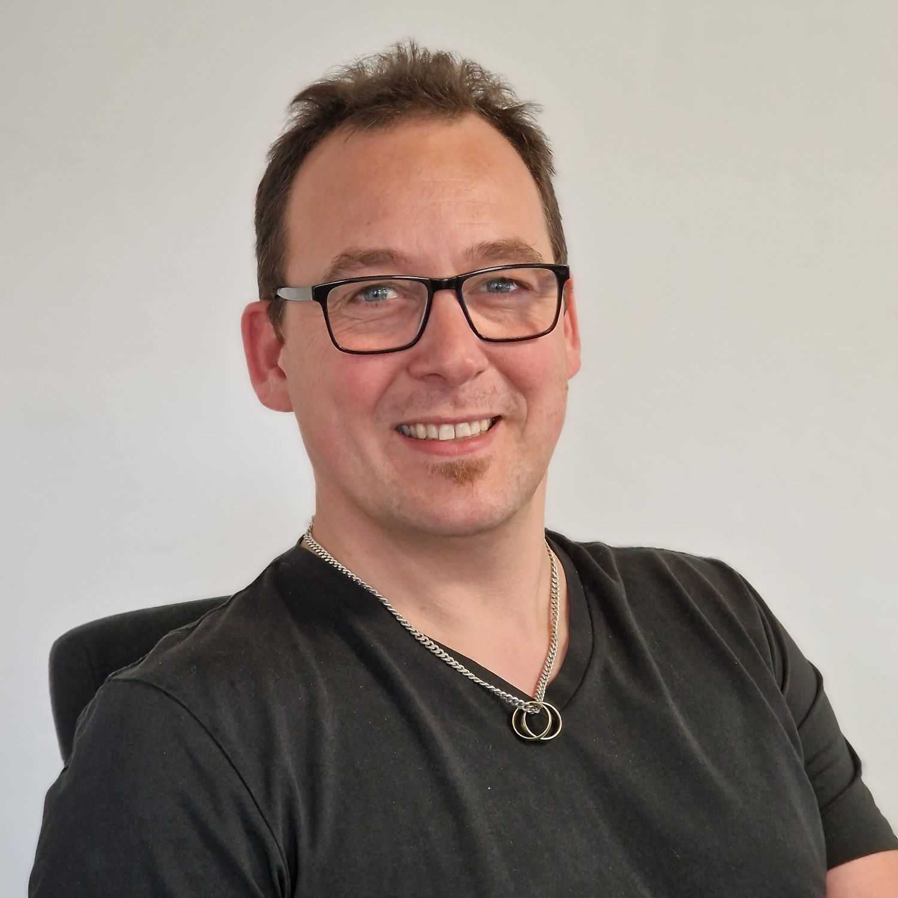
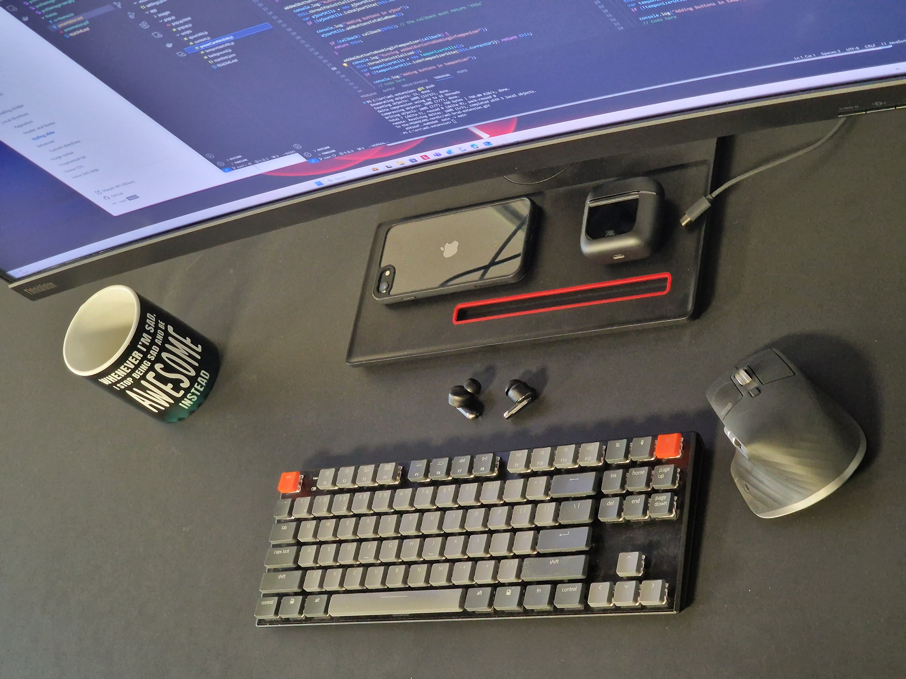

# CV 2023

Theodor Heiselberg  
Passionate .NET Developer  
since 2008

---

# Long story short

Working with C# since 2008  
Love for the web

---

# Technologies

* .NET Core
* Docker
* Pulumi
* Nuke Build
* Azure
* Hangfire

---

# Timeline

**2008 June :** Bachelor of electronics
**2008 Oct  :** Integrations (5y11m)
**2014 June :** Sys. Dev. (2y0m)
**2016 July :** Team Lead (1y7m)
**2018 Feb  :**  Sys. Dev. (0y8m)
**2018 Dec  :**  Uniconta (2y4m)
**2021 Apr  :**  Sys. Dev. (1y5m)
**2022 Aug  :**  Off the grid (0y5m)
**2023 Jan  :**  Team lead (1y2m)
**2024 Mar  :**  Searching...

---

# Wanna se my code?

---

# Stack

* Devcontainer
* Docker
* Github
* Azure CLI
* Pulumi
* Azure functions
* Static website
* Elm (Frontend)

