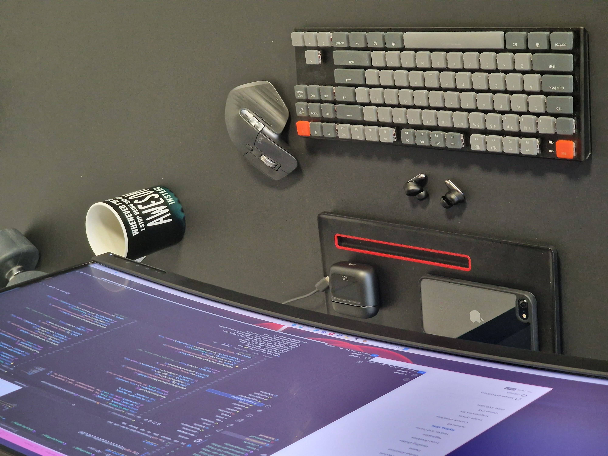

# The CV 2023

Theodor Heiselberg 
Passionate .NET Developer 
since 2008

---

# The Timeline

| Year       | Position           | Duration   |Tech|
|------------|--------------------|------------|-----|
| 2023 Jan   | Team lead          | 1y +       | Azure, Pulumi, Nuke, Docker, DDD |
| 2022 Aug   | Off the grid       | 0y 5m      | Off the grid |
| 2021 Apr   | Sys. Dev.          | 1y 5m      | Azure, Nuke, Blazor, Docker |
| 2018 Dec   | Uniconta           | 2y 4m      | XUnit, WPF, Design Patterns |
| 2018 Feb   | Sys. Dev.          | 0y 8m      | WPF, C#, XUnit |
| 2016 July  | Team Lead          | 1y 7m      | ASP.NET MVC, C#, Design Patterns |
| 2014 June  | Sys. Dev.          | 2y 0m      | WinForms, MVP, MVVM, C# |
| 2008 Oct   | Integrations       | 5y 11m     | WPF, C#, XSLT, Projet Manager |
| 2008 June  | Bachelor of Electronics |       | C, C#, Matlab UI, Statistics

---

# The Technologies

* .NET Core
* Docker
* Pulumi
* Nuke Build
* Azure
* Hangfire

---

# The Professional

Working with C# since 2008  
Passion for the web

---

# The Experience

<!-- _class: right -->
Team lead
Consultant
SCRUM
MAUI Blazor
Automation
Browser Extensions
Uniconta
Resco.net

---

# The Team Lead

When as acting team lead I employ the following guidelines:

* Delegate responsibility
* Empower team members
* Hold individuals accountable
* Fostering trust
* Respect we are all individuals
* Cultivate a positive atmosphere

---

# The Consultant

I have been working as consultant several years

* Customer communication
* Delivering fully functional solutions
* Timely delivery
* Billing

---

# The SCRUM

Rarely have I seen an acronym used for such a variety of workflows.
I really like SCRUM, but I rarely get to work with it where it has been fully adopted.

But that can work too

---

# The Automation

For me - automation is means to reac a goal
My goal is to write business logic

**The past year I have been using:**

1. [Pulumi](https://pulumi.com) for my IaC
2. [Nuke build](https://nuke.build) for build and deploy
3. Azure for hosting
4. Docker Compose for local development and pipelines

---

# ASP.NET Core Web API

Since 2016 I have been working with alost every consivable aspects of ASP.NET

---

# MAUI Blazor

Resently developed an Blazor MAUI app for Android

A Simple WebView with some functionality for notifications

---
# The Experience

**Uniconta**
Extending the UI using WPF
Using design patters when solving complex business rules

**Resco.net**
Rapid prototyping but also developing fully funcional apps
Adding triggers in C# on the server and using HTML and JS to customize the application

**Browser Extensions**
It's gradually becomming business as usual to extend third part programs with enhansed funcionality

---

# Wanna see my code?

<!-- _class: centered-link -->
[Github - The Code](https://github.com/sukkergris/job-application)
[Github - The CV](https://github.com/sukkergris/job-application-marp)

---

# The Portifolio Stack

* Devcontainer
* Docker
* Github
* Azure CLI
* Pulumi
* Azure functions
* Static website
* Elm (Frontend)

 

---

# The Man 

I'm 47, married, have three kids, two dogs, a cat and a house from the 70'ies.

Recent years my saying has become:
 

> **Whatever is worth doing - is worth doing well**

 And I just want to live well
